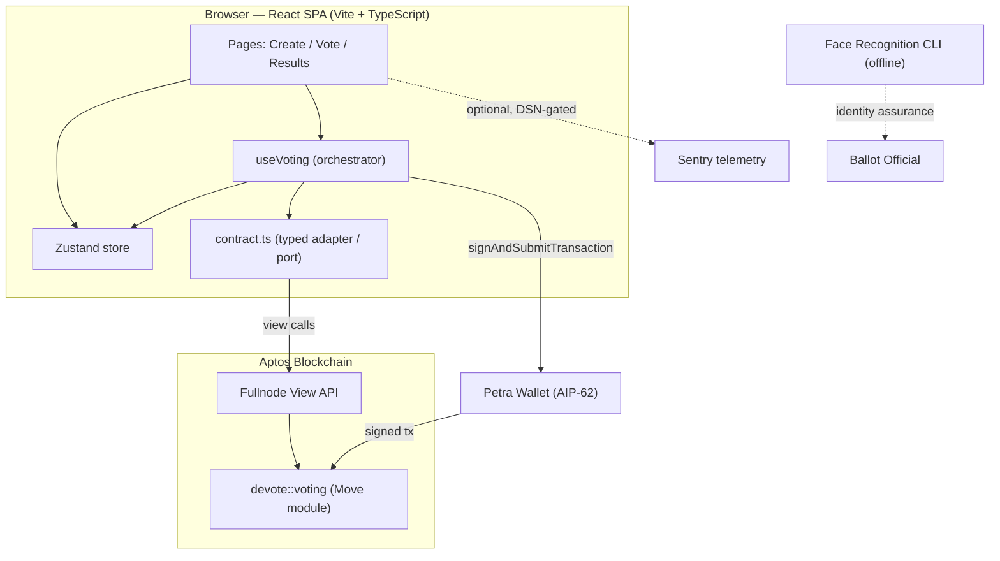

# DeVote — Decentralized Voting on Aptos

DeVote is a decentralized voting dApp. A ballot **official** creates a ballot,
registers eligible voters and choices, and opens voting; registered **voters**
each cast exactly one vote via their Aptos wallet (Petra). Tallies are read
straight from the chain. An optional, offline face-recognition CLI can assist
with voter identity assurance before on-chain registration.

> Status: modernized reference implementation. Not independently audited — see
> [SECURITY.md](./SECURITY.md) before any real-world use.

## Architecture



The frontend follows a **ports-and-adapters** design: UI components are
decoupled from the chain by a typed `contract.ts` adapter; a `useVoting` hook
orchestrates wallet signing, on-chain confirmation, and store updates. See
[ARCHITECTURE.md](./ARCHITECTURE.md) for the full breakdown.

## Monorepo layout

```
.
├── apps/web                  # React + Vite + TypeScript frontend
├── packages/move-contract    # Aptos Move smart contract (devote::voting)
├── services/face-recognition # Standalone Python identity-assurance CLI
├── tooling/plop-templates    # Scaffolding templates
└── .github/workflows         # CI, release, AI review
```

## Prerequisites

- Node.js ≥ 20 (22 recommended — see `.nvmrc`)
- pnpm ≥ 9 (`corepack enable`)
- [Aptos CLI](https://aptos.dev/tools/aptos-cli/) (for the contract)
- A Petra wallet browser extension (to use the app)

## Quickstart

```bash
pnpm install
cp apps/web/.env.example apps/web/.env.local   # then fill in values
pnpm dev                                        # http://localhost:3000
```

Set `VITE_MODULE_ADDRESS` in `.env.local` to the address you publish the Move
module under (see below).

### Smart contract

```bash
pnpm move:test                  # compile + run Move unit tests
pnpm move:compile               # compile (placeholder address)

# Publish to your account (requires `aptos init` once):
cd packages/move-contract
aptos move publish --named-addresses devote=default --assume-yes
```

### Common scripts (run from the repo root)

| Script                                 | Description                         |
| -------------------------------------- | ----------------------------------- |
| `pnpm dev`                             | Start the web app (Vite dev server) |
| `pnpm build`                           | Production build of the web app     |
| `pnpm test`                            | Run unit/component tests (Vitest)   |
| `pnpm lint` / `pnpm lint:fix`          | ESLint across the workspace         |
| `pnpm typecheck`                       | TypeScript project check            |
| `pnpm format` / `pnpm format:check`    | Prettier                            |
| `pnpm move:test` / `pnpm move:compile` | Move contract test / compile        |
| `pnpm scaffold`                        | Generate a new component or page    |

## Deployment

### Docker (self-hosted)

```bash
docker compose up --build      # serves on http://localhost:8080
```

The multi-stage image builds the app and serves it via nginx with the SPA
fallback and security headers baked in. `restart: unless-stopped` provides
self-healing.

### Static hosts

The build output in `apps/web/dist` is a static SPA. `public/_headers` and
`public/_redirects` configure security headers and SPA routing on Netlify /
Cloudflare Pages.

## Documentation

- [ARCHITECTURE.md](./ARCHITECTURE.md) — design patterns & module structure
- [SECURITY.md](./SECURITY.md) — OWASP assessment, audit, reporting
- [CONTRIBUTING.md](./CONTRIBUTING.md) — dev workflow & conventions
- [docs/DISASTER_RECOVERY.md](./docs/DISASTER_RECOVERY.md) — rollback plan
- [docs/audit-report.md](./docs/audit-report.md) — a11y & performance report
- [CHANGELOG.md](./CHANGELOG.md) — release history (semantic-release)

## License

[MIT](./LICENSE)
